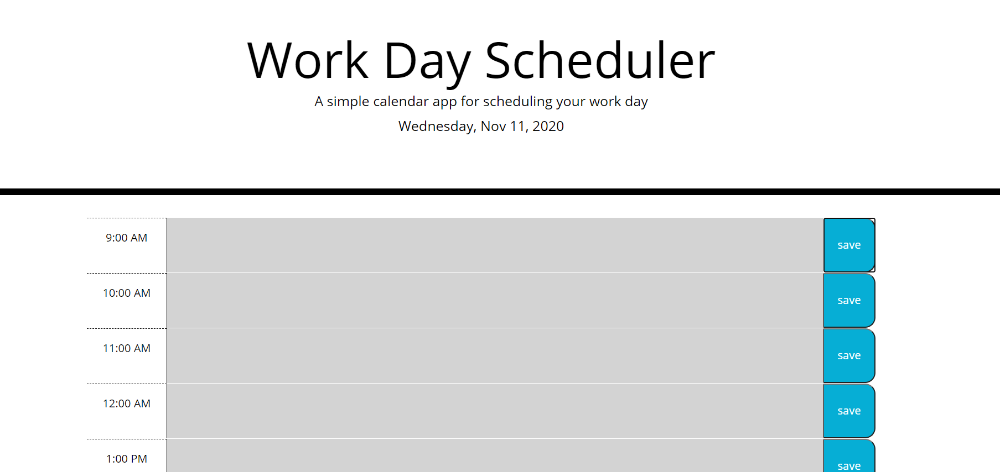

# Day-Planner

This project emphasizes the use of jQuery to create a dynamic html page. It also introduces the use of moments.js and how to implement the functions into variables to caputure current date and time.
## Main Functions
* This application is a simple day planner that allows the user to log and save events during normal buisiness hours.

## Key features
* Has color changing time blocks that utilize moments.js to determine whether a time block is in the past, present, or future.
* Displays the current date in the heading of the application.
*Has a textarea that allows user to input an event within each time block.
*Has a save button that saves the input within the textarea into the local storage.
*The above feature allows the events to stay logged on the webpage even when page is refreshed.

**Day Planner**
* Face of the day planner, without any events logged

## Link
* Link to deployed application on github pages
[Day Planner](https://lorena-ramirez.github.io/Day-Planner/)